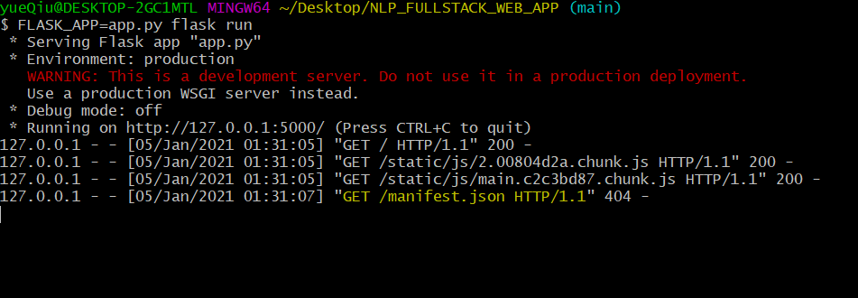

# Singularity System Inc. Coding Project v.0.0.1


## Table of contents
1. [Web Application Architecture](#architecture)
    1. [NLP classification pipeline](#pipeline)
    2. [UI/Frontend](#ui)
    3. [Backend/Server](#backend)
    4. [Database](#db)
    5. [Significant Dependencies](#depen)
2. [How to run this project locally?](#install)
    1. [Build the UI](#install-ui)
    2. [Build the Service](#install-backend)
    3. [Bundling](#bundle)
    4. [Unit test](#unit-test)
3. [Further Steps](#further-steps)


<a name="architecture"></a>

## Web Application Architecture: Python Flask + React + Node + MongoDB 

<a name="pipeline"></a>

### NLP classification pipeline 
In the previous ML project, we discuss how to process the natural language and implement the classification. You can refer to the Jupter Notebook *ML_Challange_Notebook.html* to see the feature engineering process and the final pipeline we generated.

To encapsulate the whole model along with the training data in one single file to be used anywhere, we use `Pickle library`.
```
import pickle
pickle.dump( pipeline, open( "pipeline.pkl", "wb" ) )
```
In this case we are pickling our pipeline object so we can use it later in the API to `pipeline.predict()`.

This `pipeline.pkl` file is now ready to predict any news article and classify it to either REAL or FAKE. In the app web, the user can upload the text files and click on a button for the application to preprocess the input and feed it to the trained model and show the classification back on screen.

<a name="ui"></a>

### UI/Frontend: React
This is a simple one page app built using React. There will be signup page, login page, NLP classification page, user profile pages.

<a name="backend"></a>

### Backend/Server: Flask
Since we need to “unpickle” or `pickle.load()` our model (the pipeline) to use it, the best choice would be a python web server that can receive the input over HTTP and return back the prediction result. One of the easiest and most straightforward frameworks for this is [Flask](https://flask.palletsprojects.com/en/1.1.x/).

<a name="db"></a>

### Database
The project is supported by MongoDB to store the user's information. Here we use `pyMongo` to connect the server with MongoDB.

<a name="depen"></a>

## Significant Dependences
1. **Material-UI**: The frontend stylings are supported by this library.
2. **Formik**: The tables used to submit the register & login information are handled by the library **Fromik**
3. **Yup**: The validation of the fileds: like the format of emial, phone number, display error messages
4. **JWT**: A URL-safe means of representing claims to be transferred between two parties. Implement user authentication.

<a name="install"></a>

## How to run this project locally?
Clone the repo to your computer and go inside it and open two terminals here.

<a name="install-ui"></a>

### Build the UI

1. In the first terminal, go inside the ui folder `webapp` using:

```
cd webapp
``` 

2. Once inside the folder, run the command to install all dependencies:

```
npm install
```


3. You can check the UI by runnning the command 

```
npm start
``` 


the browser should run on `localhost:3000`

> Note that the backend files will be the root folder of the project and the frontend will live in a subdirectory inside it with the name webapp.

<a name="#install-backend"></a>

### Build the service
On the second terminal, run the following commands:
1. We begin by creating a virtual environment using [virtualenv](https://towardsdatascience.com/python-virtual-environments-made-easy-fe0c603fe601) and Python 3 by running the command 

```
npm install virtualenv
```


2. Generate the venv folder in the root directory by running the command:

```
virtualenv -p python venv
```


This command should build a new folder named *venv* in your project.

3. Activate the virtual env:

```
#windows:
source venv/Scripts/activate

#Mac:
#source venv/bin/activate
```


4. Then install all the required dependencies using pip after activating the environment. 
```
pip install -r requirements.txt
```


5. Finally, we’ll run the Flask app.
```
FLASK_APP=app.py flask run
```
This will start up the service on 127.0.0.1:5000.



<a name="bundle"></a>

### Bundling
To bundle the frontend app and move it to the `/public` folder which the Flask app will serve, we will edit the `package.json` file:
```
"scripts": {
    "prebuild": "rm -r ../public",
    "build": "react-scripts build",
    "postbuild": "mv build/ ../public",
  }
```
**Now if you run `npm run build` inside `/webapp` folder then go up one directory
and run `python app.py` then visit http://localhost:5000 you will find the app up and running**

<a name="unit-tests"></a>

### Unit Tests
In the root foldedr of the repo, run
```
python -m pytest
```


<a name="further-steps"></a>

## Further Steps

There are several steps still work in progress:
1. Hook up the prefict function with frontend
2. User auto logout after 2 minutes
3. Deploy the app

